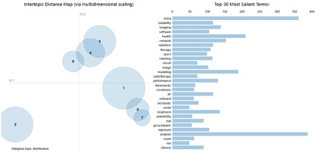

---
tags:
  - Tableau
  - Web Crawler
  - NLP
---

# Visualizing DKU’s Interdisciplinarity

> Authors: Yufan Zhang, Junyi Tao & Ran Peng

> Instructor: Prof. Xin Tong

> Spring 2022, Duke Kunshan University

---

## 1. Introduction

### Background and Research Questions

Duke Kunshan University (DKU) is characterized by its interdisciplinary and liberal arts education, which encourages students to explore a broad knowledge base and apply it flexibly. However, what is interdisciplinarity? What is the interdisciplinary knowledge architecture at DKU? How is the interdisciplinary curriculum structured? How are tracks and majors designed and interact with each other?

As DKU students, we have been pondering over these questions throughout our lives here—when we are debating which courses to explore in the first year, which major to choose in the second year, which signature work mentor to consult in the third year, and facing a decision on graduate programs and future career path.

This visualization project aims to (1) facilitate DKU students and faculty to find the answers to these questions and to (2) offer other researchers, teachers, and students insights into interdisciplinary liberal arts education.

### Visualization Flow

Despite its abstract nature, interdisciplinarity is embedded in the concrete knowledge unit, such as curriculum, faculty research area, and major-track settings. Therefore, this report will focus on visualizing interdisciplinarity at DKU in the following forms:

1. descriptive distribution of course disciplines
2. descriptive distribution of major-track required courses' disciplines
3. descriptive distribution of faculty departments and divisions
4. analytical distribution of courses (topic modeling on course description)
5. analytical distribution of faculty research specialties (topic modeling on course description)

### User Tasks/Visualization Goals

These five visualizations form a flow from descriptive information presentation (show the categories) to analytical data representation (topic modeling), based on which is the flow of user tasks:

1. Users can browse and understand the structure of disciplines in curriculum and faculty research areas from their distribution.
2. Users can identify the most multidisciplinary majors/tracks (cover the most disciplines) and the most "popular" course disciplines (contain the most courses).
3. Users can compare distributions of major/track, course disciplines, faculty divisions, and departments, which helps them analyze the relationships and interactions between these units.

---

## 2. Methods

### Data Collection

We have collected data of (1) all courses description, (2) each major/track's required course list, and (3) faculty information on Duke Scholar.

**Course**: Considering that this project aims to gain insights into DKU's didactical inclination and its interdisciplinary level, we captured data from both courses and professors' perspectives. As for the courses, we crawled the major section on the website, UGStudies. Since the required courses vary from major to major, we formed a dataset including courses' credit, ID, title, and description.

**Duke Scholar**: we employed the Duke Unique ID (DUID) API provided by Duke to obtain information, before which I get DUID with professors' email addresses. With the help of the Scholar at Duke API, we received responses including professors' status, titles, and names. Accompanied by DUID, we captured 6801 lists of professors' information. Nonetheless, a few professors do not have the habit of updating their profiles, making us clean the raw data.

### Data Cleaning

We checked missing values and mistakes, removed stop words, and lemmatized the corpus. 

### Data and Attribute Types

We also created the variable "course discipline" from course ID. For example, MATH 101 belongs to the discipline of Mathematics (MATH). The data contains the following **attribute types**:

- categorical: professors' names, courses, publications, departments, majors, education
- ordinal: course id
- numerical: terms frequency

---

## 3. Visualization and Explanation

This section contains five **visualization idioms**, including bubble charts, treemaps, and topic modeling.

### 3.1 Course disciplines

This visualization describes the disciplines distribution in DKU using a bubble chart. Its function is to show the distribution of the required courses in each major by size and color. Disciplines with the most courses are HIST and MEDIART, followed by POLSCI and PUBPOL.

### 3.2 Major-track required courses' disciplines

In this visualization, we aim to display the distribution of DKU majors by a treemap. This type of visualization performs well when many components match the different tracks in majors. Various sizes and colors indicate the number of tracks in one major and its courses. Within each sector, overall credits and track descriptions are displayed in turn. Hoving over the blocks we can see the major-track name and course counts.

### 3.3 Faculty departments/Divisions

This treemap visualizes faculty departments and divisions (Social Science, Natural Science, Arts and Humanities). The aim is to display the grouped and nested departments in a hierarchical structure. The sizes and color shades show that Natural Science has the most faculty and research areas included. The most fundamental discipline (department) in each division is math, media & arts, and global China studies and economic, which is different from the course disciplines and major-track distribution (Vis 1 & 2).

### 3.4 Course topic modeling

We perform the topic modeling to identify seven topics in DKU and all courses' descriptions using pyLDAvis (Sievert and Shirley, 2014). This machine learning model creates the clusters of the words from the dataset, allowing us to find the hidden patterns embedded in the texts. This visualization is interactive (the HTML file is zipped), and here we analyze topic four as an example.

The right part of the visualization presents the top 30 keywords that summarize each topic. Blue bars show overall frequency, and the red ones show the estimated frequency of the term generated by the topic. In this example, the most frequent words "health", "global", "environmental", "human", and "policy" demonstrate that this topic might be "global health, environmental science, and public policy".

On the left side, each bubble represents a topic, where the larger the bubble, the higher percentage of terms in the corpus are about that topic. The distances between bubbles represent their semantic similarities, i.e., their closeness in meaning.

### 3.5 Faculty research specialties topic modeling

Similarly, we conducted topic modeling on DKU faculty publication titles. The topic keywords are shown in the table, though we cannot understand the topics by simply looking at them. This might be because only those whose publication data is posted on Duke Scholar are included, so the corpus is too small and biased. 

Since the topic modeling results are not informative, we will not further analyze this visualization. However, this data visualization is effective because it clearly shows that the data and topic modeling results are problematic.

## 4. Evaluation

We will evaluate the effectiveness of the visualization utilizing Munzner's what-why-how framework ( 2014). Overall, these visualizations are compelling.

- Vis 1 and 2 show course disciplines distribution. They facilitate identifying the most multidisciplinary majors/tracks and the most "popular" course disciplines.
- Vis 2 and 3 use treemap to visualize the structures of disciplines in the form of curriculum and department/division setting, helping to compare and analyze knowledge architecture at DKU.
- Vis 4 and 5 present topic distributions and keywords. They facilitate exploring and finding course topics and faculty expertise areas and comparing and drawing connections between faculty research areas and course design.

One advantage is that we utilized multiple visualization idioms, providing various perspectives on examining interdisciplinarity. But, one shortcoming is that the topic modeling visualization requires background knowledge of statistics and NLP.

One limitation is that the data, especially duke scholar data, is incomplete, thus introducing bias to the visualization. The potential resolution is to obtain data from an extensive academic database, like ScienceofWeb and Scopus, querying with scholars' URI.

## 5. Conclusion

In summary, the five visualizations offer insights into the interdisciplinary architecture at DKU. The differences between the distributions of curriculum disciplines, major-track, and faculty department shed light on improvement on current educational strategies (faculty recruiting, major-track design, etc.) at DKU.
Meanwhile, the visualizations demonstrate the importance of (1) seeing data from various perspectives, (2) finding concrete embodiment of abstract concepts, and (3) checking data quality and reasoning in analysis. Furthermore, we are going to develop this project in the future further to answer questions including:

- How has DKU's interdisciplinary nature influenced its students and faculty?

- What are the differences between DKU's interdisciplinary education and other universities, such as Duke?
