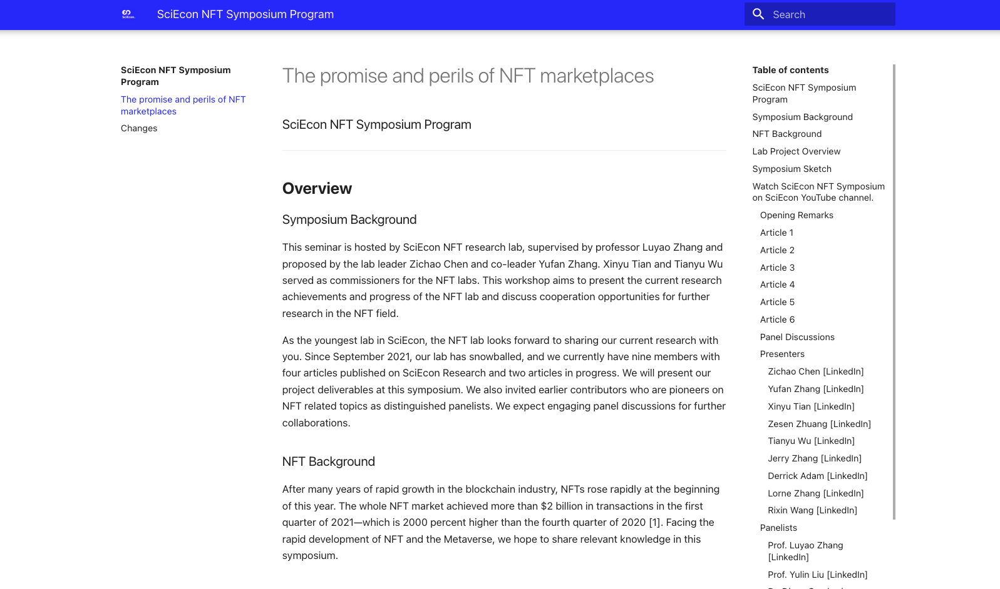

# How I Build yufanz.xyz 记录一下建站的过程

> Yufan Zhang

---

好像从 2021 年春天开始，就很羡慕那些有自己网站的人。我当然也知道个人博客或者网站这件事情其实在中国大陆并不是一件回报值得付出的事情。

但，拥有一个网站，来记录和展示自己的 personality，听上去就足够酷了！

然而，对于一个当时误认为 HTML 是一名编程语言的我来说，从零搭建一个网站确实不是一件易事，建站这件事也就搁置了下来。

## Notion 初次尝试

时间来到 21 年秋天，经 [Junkai](https://keon.im) 的安利，我上手了著名的笔记软件 Notion。
我深深地被它高度的可定制化（作为一个笔记软件）和极简的布局所吸引，也萌生了依靠 Notion 搭建个人网站的想法。

首先，我在 Notion 上面排版了一个个人网站的 Page (显而易见的借鉴了当时的 [keon.im](https://keon.im))，也预留出了很多 Subpages for me to fill in later (e.g., the music that I enjoy).
然而，还是对网络技术一无所知的我，并不知道怎么把 Notion 中的某个 page 链接到早早就购置好的域名上。
简单地尝试了几个方法之后，也灰头灰脸的结束了第一次用 Notion 搭建主页的计划。

{: style="border: 1px solid #ddd;""}

Fig 1 - The first homepage I built with Notion

## fleek + mkdocs 初次尝试

21 年冬天，我和 SciEcon NFT Research Lab 中的其他同学成功举办 SciEcon NFT Symposium 之后，教授和我们决定将整个 Symposium 的介绍和各个同学文章的介绍做成一个网页，并部署到某个去中心化的平台上。
经过一些筛选和 Zesen 的建议，我们最终选择了使用 [mkdocs](https://www.mkdocs.org/) 来制作网页，再通过 [fleek.co](https://fleek.co/) 将网页部署在 [IPFS](https://github.com/ipfs/ipfs) 上，是用于存储和访问文件、网站、应用程序和数据的分布式文件系统。

在学习了 markdown 语言之后，我又选择了选择 [mkdocs-material](https://squidfunk.github.io/mkdocs-material/)这个主题，并且根据文档简单地定制化了一些设置。

至于部署到 IPFS 上，只需要把刚刚通过 mkdocs 制作的网页上传到GitHub的一个repo，再在 [fleek.co](https://fleek.co/) 上新建site并且链接到GitHub的repo即可。
在创建site时也可以直接选IPFS下的mkdocs框架，fleek.co会自动部署网页。你可以在[这里](https://sciecon-nft-symposium.on.fleek.co/)看到最终的网页。

{: style="border: 1px solid #ddd;""}

Fig 2 - The page for SciEcon NFT Symposium built with fleek + mkdocs

## Notion 再次尝试

## fleek + mkdocs 目前网站