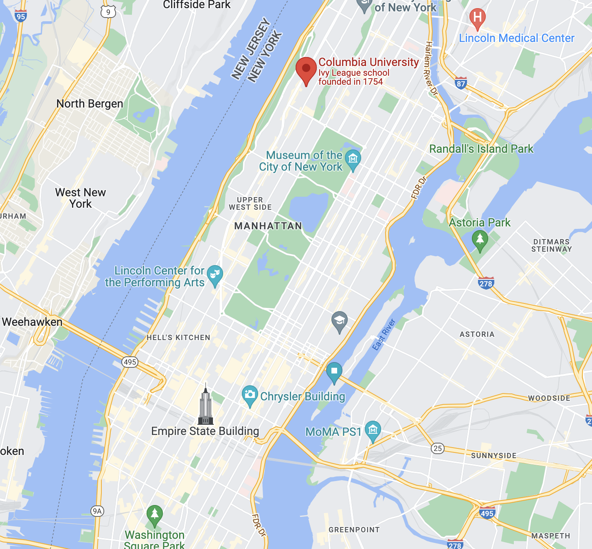

# Graduate Programs of DS (Data Science) and CS (Computer Science)

---

## [**Columbia University**](https://www.columbia.edu/)

**Location** New York City, New York

**U.S. News** #2

**CSRankings (AI)** #14

### [M.S. in Data Science](https://datascience.columbia.edu/education/programs/m-s-in-data-science/)

**How Long**

1 Year (12 credits in the fall, 12 credits in the spring, and 6 credits in the fall)

**Curriculum**

- 3 courses in Computer Science
- 1 course in Engineering
- 3 courses in Statistics
- 3 (9 credits) of electives
- Capstone Project
    - All of our students complete capstone projects with industry affiliates and thought leaders.

---

## [**New York University**](https://nyu.edu/)

**Location** New York City, New York

**U.S. News** #28

**CSRankings (AI)** #23

### [Master of Science in Data Science](https://cds.nyu.edu/masters-program/)

**How Long**

2 Years (26 credits: 9 credits/semester)

**Curriculum**

