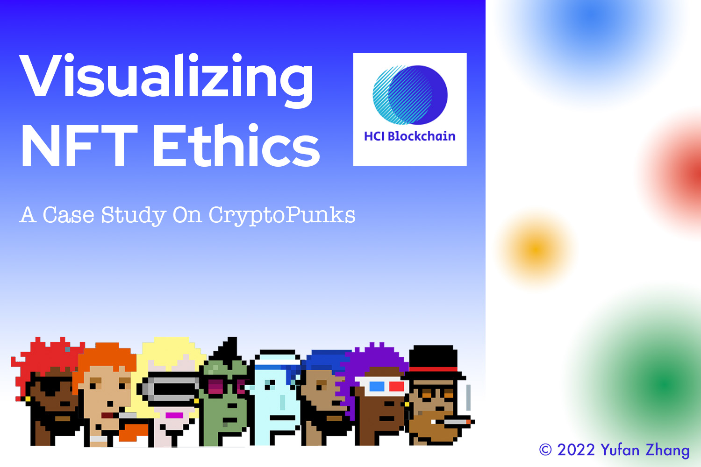
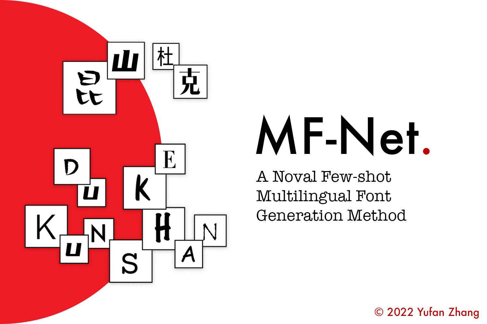
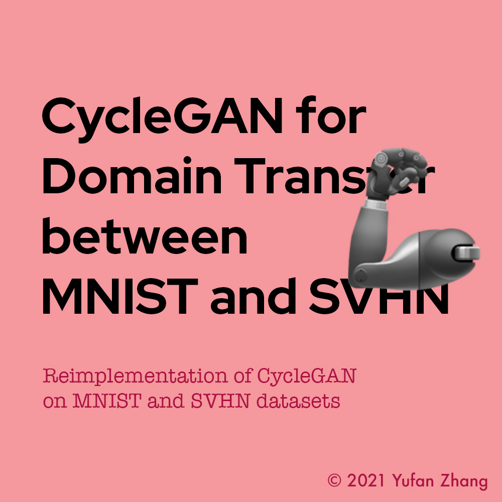

# Projects

<!-- 

Yufan has participated in several interdisciplinary research projects on computer vision, computational biology, and blockchain-related topics like non-fungible token. 
Supervised by [Prof. Peng Sun](https://scholars.duke.edu/person/Peng.Sun1), he developed a novel GAN-based model for few-shot stylized multilingual font generation. 
Supervised by [Prof. Huansheng Cao](https://scholars.duke.edu/person/Huansheng.Cao) and Prof. Gaoyang Li, he proposed a novel Graph Neural Network (GNN) based model for predicting catalytic turnover numbers in Escherichia coli. 
He is now working on a blockchain-related research project supervised by [Prof. Luyao Zhang](https://scholars.duke.edu/person/luyao.zhang) and [Prof. Xin Tong](https://xintong.ca/), on ethical issues in NFT design and marketplace. 
He also does not waste any chance to learn new skills, practice the newly-learning skills, and propose new ideas for exploratory research.

 -->

---

## **#****Research**

<!-- 

<a href="AlphaFold">

Using AlphaFold and GNN to Predict Catalytic Efficiency

</a>

[
AlphaFold and GNN
](./AlphaFold.md)

<a href="MFNet">

A Novel Few-Shot Stylized Multilingual Font Generation Method

</a>

[
Few-shot Font Style Transfer
](./MFNet.md)

 -->

<!-- AlphaFold -->

<a href="AlphaFold">

Using AlphaFold and GNN to Predict Catalytic Efficiency

</a>

Using AlphaFold and GNN to Predict Catalytic Efficiency

> 2022.08 - Present

[Read more](./AlphaFold.md)

<!-- NFTEthics -->

<a href="AlphaFold">

Visualizing NFT Ethics: A Case Study On CryptoPunks

</a>

Visualizing NFT Ethics: A Case Study On CryptoPunks

> 2022.03 - 2022.06

[Read more](./NFTEthics.md)

<!-- MFNet -->

<a href="AlphaFold">

A Novel Few-Shot Stylized Multilingual Font Generation Method

</a>

MF-Net: A Novel Few-Shot Stylized Multilingual Font Generation Method

> 2022.01 - 2022.05

[Read more](./MFNet.md)

---

## **#****Innovate**

<!-- First Row -->

<!-- DKUVis -->

<a href="DKUInterdisciplinarity">

Visualizing DKU’s Interdisciplinarity

</a>
> 2022.05

<!-- HeartDisease -->

<a href="HeartDisease">

Heart Disease Detection Using Machine Learning

</a>
> 2021.11

<!-- CycleGAN -->

<a href="CycleGAN">

Using CycleGAN for Domain Transfer between MNIST and SVHN

</a>
> 2021.08

<!-- =========== -->
<!-- Second Row -->

<!-- HigherEdu -->

<a href="HigherEdu">

Evaluating Higher Education Using Machine Learning

</a>
> 2021.04

