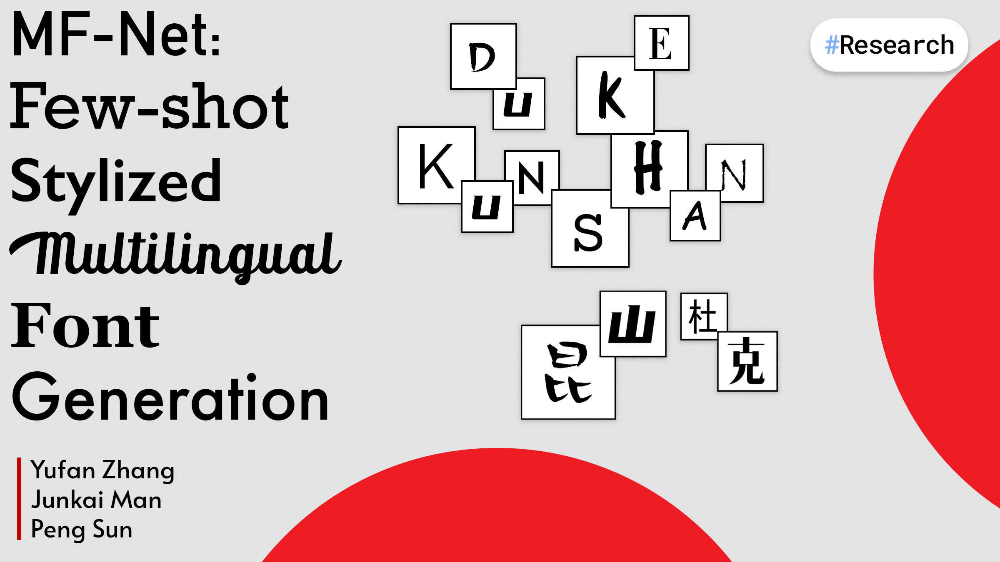

# **Research**

---

<!-- {: style="height:200px"} -->

### [Using AlphaFold and GNN to Predict Catalytic Efficiency](Research/AlphaFold.md)

##### Aug 2021 - Present

> *Supervised by [Prof. Huansheng Cao](https://scholars.duke.edu/person/Huansheng.Cao) and Prof. Gaoyang Li*

Implement convolutional autoencoders and heterogeneous GNN to predict catalytic turnover numbers in Escherichia coli.

**[[GitHub](https://github.com/iambrucez/AlphaFold-Research)] [Paper]**

---

<!-- {: style="height:200px"} -->

### [On Ethics of Ethereum NFT](Research/HCIBlockchain.md)

##### Mar 2022 - Present

> *Supervised by [Prof. Xin Tong](https://xintong.ca/) and [Prof. Luyao Zhang](https://scholars.duke.edu/person/luyao.zhang)*

Use quantitative and qualitative methods to identify, describe, and further categorize ethical issues in NFT design and marketplace.

**[GitHub] [Paper]**

---

<!-- {: style="height:200px"} -->

### [MF-Net: Few-Shot Stylized Multilingual Font Generation](Research/MFNet.md)

##### Jan 2022 - Apr 2022

> *Supervised by [Prof. Peng Sun](https://scholars.duke.edu/person/Peng.Sun1)*

Using GAN for font style transfer between untrained languages.

**[[GitHub](https://github.com/junkaiman/FTransGAN_Experiments)] [Paper]**

---